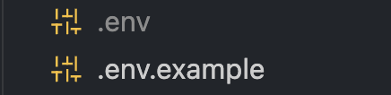

# Projeto em equipes (Formação DEV) - WeekMe

### Instalação

O primeiro passo é instalar as dependências após ter clonado o projeto. Precisamos abrir o terminal e rodar o seguinte comando

```bash
npm i
```

### Configuração

Temos que criar os arquivos `.env` dentro da raiz de cada projeto que fica dentro de `apps/` seguindo a base do seu exemplo `.env.example`. Cada arquivo `.env.example` tem um demonstrativo e comentários para demostrar como deve ser feito a sua configuração. Quando terminar de configurar o resultado esperado deve ser algo semelhante a imagem abaixo:



Na primeira vez que rodarmos o projeto é importante deixar configurado o banco de dados e para precisamos criar as tabelas e alguns dados essenciais para o projeto funcionar corretamente. Então rodaremos o seguinte comando na na pasta raiz:

```bash
npm run prisma:seed
```

### Execução

Depois de ter realizado todos os passos anteriores estamos aptos a rodar o projeto sendo necessário apenas executar o seguinte comando

```bash
npm run dev
```

### Informações adicionais

Para analisar os dados podemos acessar a pasta `apps/api` e executar o comando

```bash
npx prisma studio
```

Podemos também usar ferramentas mais avançadas como: DBeaver, pgAdmin...
